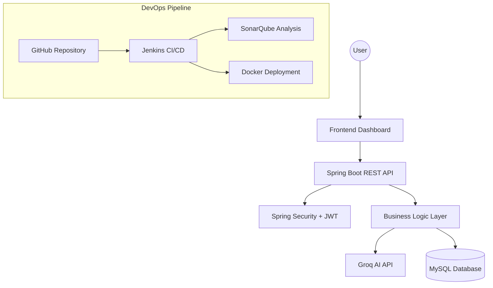

# ☁️ CloudCompare AI

[](https://openjdk.org)
[](https://spring.io/projects/spring-boot)
[](https://jenkins.io)
[](https://sonarqube.org)
[](https://docker.com)
[](https://github.com/raghavendra2006/CLOUD-COMPARE-AI)
[](LICENSE)

CloudCompare AI is a multi-cloud comparison and recommendation platform that helps users evaluate cloud infrastructure services across AWS, Azure, Google Cloud Platform (GCP), Oracle Cloud Infrastructure (OCI), and Alibaba Cloud.

The platform analyzes cloud resources such as compute, storage, pricing, and regional availability to generate intelligent recommendations based on cost, performance, and optimization priorities.

**Topics:** `spring-boot`, `docker`, `jenkins`, `multi-cloud`, `ai`, `groq`, `java-21`

---

# ⏱️ Quick Start (Docker Compose)

The fastest way to run CloudCompare AI locally is via Docker Compose:

```bash
# 1. Clone the repository
git clone https://github.com/raghavendra2006/CLOUD-COMPARE-AI.git
cd CLOUD-COMPARE-AI

# 2. Start the application
docker-compose up -d --build
```
*The platform will be available at `http://localhost:5000`*

---

# 🚀 Features

- Multi-cloud infrastructure comparison
- AI-assisted recommendation engine using Groq + Llama 3.1
- Cost and performance analysis
- Region-wise cloud comparison
- Interactive analytics dashboard
- JWT-based authentication and authorization
- RESTful API architecture
- Dockerized deployment
- Jenkins CI/CD integration
- SonarQube static code analysis
- Rate limiting and centralized exception handling

---

# 🏗️ System Architecture




---

# 🛠️ Tech Stack

| Layer | Technologies |
|---|---|
| Backend | Java 21 (Virtual Threads), Spring Boot 3 |
| Security | Spring Security, JWT |
| Database | MySQL, H2 |
| ORM | Spring Data JPA, Hibernate |
| AI Integration | Groq API, Llama 3.1 |
| Frontend | HTML, CSS, JavaScript, Chart.js |
| DevOps | Docker, Jenkins, SonarQube |
| Testing | JUnit 5, Mockito, JaCoCo |

---

# 📂 Project Structure

```text
cloudcompare-ai/
│
├── src/
│   ├── main/
│   │   ├── java/
│   │   ├── resources/
│   │   └── static/
│   │
│   └── test/
│
├── docker/
├── docs/
├── screenshots/
├── .env.example
├── Dockerfile
├── docker-compose.yml
├── pom.xml
└── README.md
```

---

# 🔐 Security Features

- JWT-based stateless authentication
- Protected API endpoints
- Secure environment variable configuration
- Centralized exception handling
- Rate limiting for API abuse prevention
- Restricted CORS configuration

---

# ⚡ Performance & Reliability Architecture

- Java Virtual Threads (Project Loom)
- Caffeine caching
- GZIP compression
- Optimized REST API responses
- Resilience4J circuit breaker integration

---

# 📊 Core Functionalities

## Cloud Comparison

Compare services across:
- AWS
- Azure
- GCP
- OCI
- Alibaba Cloud

Comparison parameters:
- vCPUs
- RAM
- Storage
- Region
- Pricing
- Performance score

---

## AI Recommendation Engine

The AI recommendation engine analyzes your input and returns curated suggestions.

**Example Use Case:**
* **Input:** *"Compare AWS RDS vs GCP Cloud SQL vs Azure SQL for a 500GB OLTP workload"*
* **Output:** The platform leverages Groq (Llama 3.1) to return the top 5 matching database services, ranked by a calculated score, alongside live pricing estimates, model capabilities, and specific architectural justifications tailored to your exact workload.

Features include:
- Analyzes infrastructure requirements
- Evaluates provider pricing
- Calculates ranking scores
- Suggests optimized cloud providers
- Generates AI-assisted recommendations

---

## Dashboard Analytics

Dashboard includes:
- Cost comparison charts
- Performance analysis graphs
- Ranking visualization
- Region-based insights
- Optimization recommendations

---

# 🔌 API Endpoints

| Method | Endpoint | Description | Authentication |
|---|---|---|---|
| POST | `/api/auth/signup` | Register new user | Public |
| POST | `/api/auth/login` | User login | Public |
| GET | `/api/test` | Health check API | Public |
| POST | `/api/compare` | Compare cloud services | JWT Required |
| POST | `/api/ai-compare` | AI-powered recommendations | JWT Required |
| GET | `/api/regions` | Fetch provider regions | JWT Required |

---

# 📥 Sample API Request

## Compare Cloud Services

```json
POST /api/compare

{
  "provider": "AWS",
  "vcpu": 4,
  "ram": 16,
  "storage": 200,
  "region": "ap-south-1",
  "priority": "cost"
}
```

---

# 📤 Sample API Response

```json
{
  "recommendedProvider": "AWS",
  "estimatedMonthlyCost": 82.45,
  "performanceScore": 91,
  "optimization": "Best balance between cost and performance"
}
```

---


# ⚙️ Environment Variables

Create a `.env` file:

```env
GROQ_API_KEY=your_groq_api_key
JWT_SECRET=your_jwt_secret
DB_URL=jdbc:mysql://localhost:3306/cloudcompare_ai
DB_USERNAME=root
DB_PASSWORD=your_password
```

---

# 🧪 Testing

Run unit and integration tests:

```bash
./mvnw test
```

Generate JaCoCo coverage report:

```bash
./mvnw jacoco:report
```

---

# 📸 UI & Dashboard

> **Note:** The platform features a premium dark/light mode toggle with interactive Chart.js visualizations, particle effects, and dynamic glassmorphism cards.

To see the interactive dashboard, charts, and AI comparison cards in action, simply run the application locally or via the Quick Start guide. 

*(Screenshots can be added to the `screenshots/` directory)*

---

# 🚦 Troubleshooting

| Issue | Cause | Solution |
|---|---|---|
| 429 Too Many Requests | Rate limit exceeded | Wait before retrying |
| Invalid JWT Token | Token expired | Login again |
| MySQL Connection Failed | Database unavailable | Verify DB service |
| Groq API Error | Invalid API key | Check `.env` configuration |

---

# 🔮 Future Enhancements

- Kubernetes deployment support
- Real-time cloud pricing APIs
- Terraform integration
- AI chatbot assistant
- Multi-user collaboration
- Advanced cloud cost prediction
- Carbon footprint estimation

---

# 🤝 Contributing

We welcome contributions! Please see our [CONTRIBUTING.md](CONTRIBUTING.md) for detailed guidelines on how to submit issues, use templates, and create pull requests.

1. Fork the repository
2. Create a feature branch (`git checkout -b feature/AmazingFeature`)
3. Commit changes (`git commit -m 'Add some AmazingFeature'`)
4. Push to the branch (`git push origin feature/AmazingFeature`)
5. Open a Pull Request

---

# 📄 License

This project is licensed under the MIT License.

---

# 👨‍💻 Author

Developed by Raghavendra

GitHub:
https://github.com/raghavendra2006
